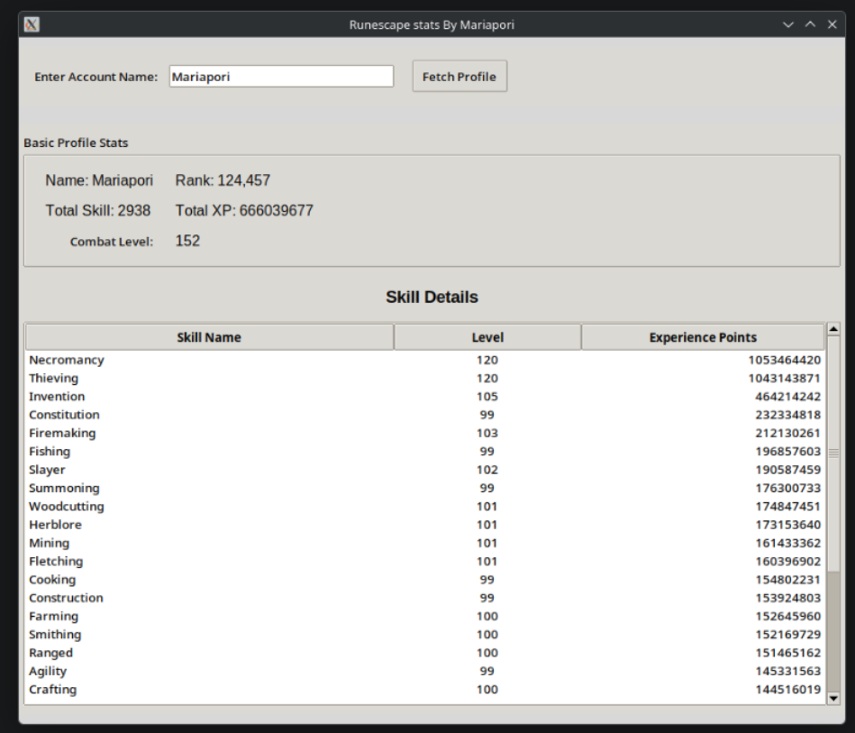

# Python GUI Application Project

This is a test project designed for developing an agent-based Graphical User Interface (GUI) application using Python.

## 🚀 Project Goal
The primary goal of this project is to build and test a functional desktop GUI application.

## ⚙️ Technical Specifications & Environment
*   **Target Hardware:** AMD RX Vega56 8GB GPU.
*   **Development Tooling:** LM Studio for local model management/testing.
*   **Model Target:** google/gemma-4-e4b (via agentic workflow).

## Screenshots
Here are some screenshots of the GUI application:

